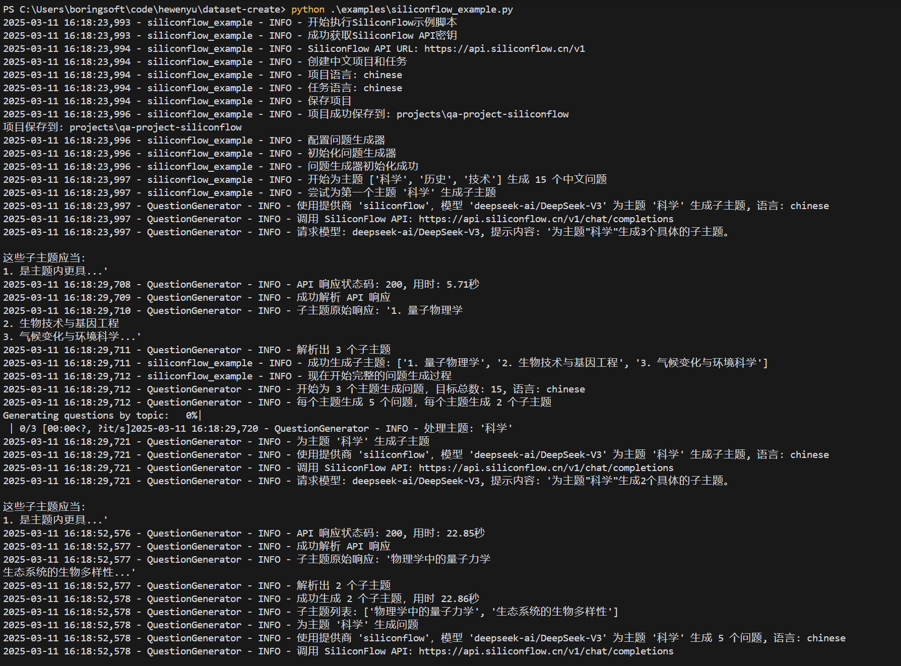

# 数据集创建工具

[中文](README_zh.md) | [English](README.md)

一个用于生成训练数据集以微调小型语言模型的工具。

## 概述

本项目提供了一个流程化的工作流程：

1. 准备问题集或提示
2. 将其馈送给大型语言模型（如GPT-4、Claude等）
3. 生成结构化的训练数据集
4. 使用这些数据集微调小型模型

## 安装

```bash
# 从源代码安装
git clone https://github.com/hewenyu/dataset-creator.git
cd dataset-creator
pip install -e .
```

## 使用方法

### 基本用法

```python
from dataset_creator import DatasetProject
from dataset_creator.data_gen import QuestionGenerator
from dataset_creator.fine_tune import ModelFineTuner

# 创建新的数据集项目
project = DatasetProject(name="my-project")

# 定义一个任务
task = project.create_task(
    name="qa-task",
    instruction="准确简洁地回答给定问题",
)

# 生成问题
question_gen = QuestionGenerator()
questions = question_gen.generate_from_topics(
    topics=["科学", "历史", "技术"],
    subtopics_per_topic=3,           # 每个主题生成3个子主题
    questions_per_subtopic=3,        # 每个子主题生成3个问题
    max_total_questions=30           # 限制总问题数为30个
)

# 使用大语言模型创建数据集
dataset = task.create_dataset(
    name="训练数据",
    model="gpt-4",
    questions=questions
)

# 微调小型模型
fine_tuner = ModelFineTuner()
fine_tuned_model = fine_tuner.fine_tune(
    dataset=dataset,
    base_model="llama-3-8b",
    epochs=3
)
```

### 增强的问题生成功能

本工具提供了对问题生成的精细控制：

```python
from dataset_creator.data_gen import QuestionGenerator
from dataset_creator.data_gen.question_generator import QuestionGeneratorConfig

# 配置问题生成器的高级参数
question_config = QuestionGeneratorConfig(
    questions_per_topic=5,         # 每个主题的问题数量
    questions_per_subtopic=3,      # 每个子主题的问题数量
    max_total_questions=50,        # 最大总问题数量限制
    temperature=0.7                # 控制生成的随机性
)

question_gen = QuestionGenerator(config=question_config)

# 精确控制问题生成
questions = question_gen.generate_from_topics(
    topics=["科学", "历史", "技术"],
    subtopics_per_topic=3,           # 每个主题生成3个子主题
    questions_per_subtopic=4,        # 每个子主题生成4个问题
    max_total_questions=40           # 限制总问题数为40个
)
```

### 多语言支持

该工具支持生成不同语言的数据集。您可以在项目、任务或数据集级别指定语言：

```python
from dataset_creator import DatasetProject
from dataset_creator.core.task import Language
from dataset_creator.data_gen import QuestionGenerator
from dataset_creator.data_gen.generator import GeneratorConfig

# 创建一个默认语言为中文的项目
project = DatasetProject(name="中文项目", language=Language.CHINESE)

# 创建任务（将继承项目的中文语言设置）
task = project.create_task(
    name="中文问答",
    instruction="准确简洁地回答给定问题",
)

# 或者在中文项目中显式创建英文任务
english_task = project.create_task(
    name="english-qa",
    instruction="Answer questions accurately and concisely",
    language=Language.ENGLISH
)

# 配置问题生成器为中文
question_config = QuestionGeneratorConfig(language=Language.CHINESE)
question_gen = QuestionGenerator(config=question_config)

# 生成中文问题
questions = question_gen.generate_from_topics(
    topics=["科学", "历史", "技术"],
    subtopics_per_topic=3,           # 每个主题生成3个子主题
    questions_per_subtopic=3,        # 每个子主题生成3个问题
    max_total_questions=30           # 限制总问题数为30个
)
```

### 命令行界面

该工具还提供了CLI，便于使用：

```bash
# 从一组主题生成数据集
dataset-creator generate-dataset --topics "科学,历史,技术" --output my_dataset.jsonl

# 使用精确的数量控制生成问题
dataset-creator generate-questions --topics "科学,历史,技术" --subtopics-per-topic 3 --questions-per-subtopic 4 --max-total-questions 50

# 生成中文问题
dataset-creator generate-questions --topics "科学,历史,技术" --language chinese --subtopics-per-topic 3 --questions-per-subtopic 4 --max-total-questions 40 --output chinese_questions.json

# 创建中文项目
dataset-creator create-project --name "中文项目" --language chinese

# 创建指定语言的任务
dataset-creator create-task --project-dir "./projects/my-project" --name "中文任务" --instruction "用中文回答问题" --language chinese
```

<!-- doc/png/example.png -->



## 功能特点

- 简单易用的数据集生成API
- 可定制的不同LLM提供商的提示模板
- 支持不同的数据集格式（JSONL、CSV等）
- 与流行的微调框架集成
- 支持多个模型提供商，包括OpenAI和SiliconFlow
- **多语言支持**，可创建不同语言的数据集（目前支持中文和英文）
- **精确的问题生成控制**，能够指定每个主题的问题数量、每个子主题的问题数量以及最大总问题数量

## 许可证

MIT许可证
